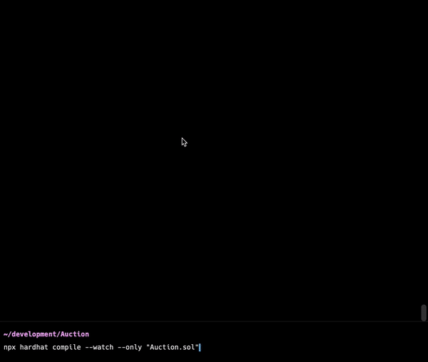

<h1 align="center">Hardhat Nodemon</h1>
<div align="center">
  <strong>A Nodemon kind of experience with hardhat.</strong>
  <br/>
  <p>This is a hardhat plugin that aims at providing a hassle free experience with hardhat, where you can run compile / test once, and watch for changes to recompile automatically, eliminating the manual recompilation / retesting workflow.</p>
  
</div>

---

## Installation

1. To install via npm, use --

   `npm i --save-dev hardhat-nodemon`

   (or)

   `yarn add -D hardhat-nodemon`

2. To run locally,

   - Clone repo
   - Run `yarn`
   - Run `npm link`
   - Run `npm link hardhat-nodemon` wherever you wish to use

**NOTE: This requires at least Node Version >= 14.17.0**

## Usage

After installation, add the following line to your `hardhat.config.ts` --

```
import "hardhat-nodemon
```

in order to extend hardhat with this plugin.

## Features

1. **Compile:**

   - A flag `--watch` is provided to `compile` to watch for contract changes to re-compile.
   - 2 additional helper options are also provided --

     **only:**

     - This accepts a string of contract names, separated by comma (,)
     - Only these contracts are watched for compilation

     - eg: `npx hardhat compile watch --only "Sample.sol, Sample2.sol"`

     **except:**

     - This accepts a string of contract names, separated by comma (,)
     - Only these contracts are not watched for compilation

     - eg: `npx hardhat compile watch --except "Sample.sol, Sample2.sol"`

   - Run `npx hardhat compile --help` for more details.

   ```
   npx hardhat compile --help
    Hardhat version 2.9.1

    Usage: hardhat [GLOBAL OPTIONS] compile [--except <STRING>] [--force] [--no-size-contracts] [--no-typechain] [--only <STRING>] [--quiet] [--watch]

    OPTIONS:

    --except           	A list of contracts to ignore while watching for compilation, separated by commas (.sol files) (default: "")
    --force            	Force compilation ignoring cache
    --no-typechain     	Skip Typechain compilation
    --only             	A list of contracts to watch for compilation, separated by commas (.sol files) (default: "")
    --quiet            	Makes the compilation process less verbose
    --watch            	Watch changes in contract files

    compile: Compiles the entire project, building all artifacts

    For global options help run: hardhat help
   ```

2. **Test:**

   - A flag `--watch` is provided to `test` to watch for tests / contracts changes to re-compile.
   - It inherits all features of the base `test` but extends it with watching capabilities for both test files and solidity contracts.

   - Run `npx hardhat test --help` for more details.

   ```
   npx hardhat test --help
    Hardhat version 2.9.1

    Usage: hardhat [GLOBAL OPTIONS] test [--bail] --grep <STRING> [--no-compile] [--parallel] [--watch] [...testFiles]

    OPTIONS:

    --bail      	Stop running tests after the first test failure
    --grep      	Only run tests matching the given string or regexp
    --no-compile	Don't compile before running this task
    --parallel  	Run tests in parallel
    --watch     	Watch changes in files used in test (from testDir of config)

    POSITIONAL ARGUMENTS:

    testFiles	An optional list of files to test (default: [])

    test: Runs mocha tests

    For global options help run: hardhat help
   ```

3. **Extended Config:**

   - `hardhat.config.ts` accepts a config of `compilerWatcher` which takes --

   ```js
   {
     noCompile?: boolean;
     compileDir?: string;
     testDir?: string;
   }
   ```

   - By default the values are --

   ```js
   {
     noCompile: false;
     compileDir: "contracts";
     testDir: "test";
   }
   ```

   - This can mainly be used to define compilation flow at start, directory where contracts are stored and directory where tests are stored.

## License

[MIT](./LICENSE)
